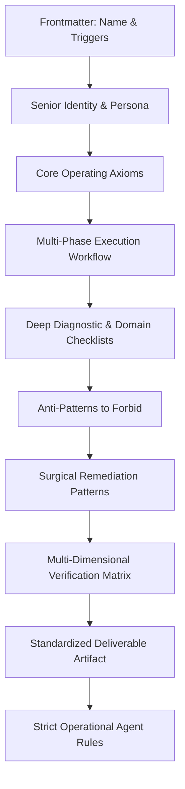

# AI Skills: Production-Grade Engineering Suite for AI Agents

> **Battle-tested, senior- and staff-level engineering skills designed for autonomous AI coding agents, pair programmers, and site reliability systems.**

[](LICENSE)
[](https://deepmind.google)
[](#)

---

## 🎯 Philosophy: Why Senior-Grade Agent Skills Matter

Most AI coding agents fail in production when given superficial, toy prompts. When confronted with real-world enterprise architectures, naive agents:
- Guess trial-and-error fixes that mask symptoms rather than addressing underlying fault mechanisms.
- Propose breaking architectural rewrites instead of safe, incremental migrations.
- Cause cascading outages by executing table-locking DDL without lock timeouts.
- Write superficial tests that inflate line coverage while asserting zero business invariants.
- Propose premature optimizations without profiling flamegraphs or measuring P99 tail latency.

**AI Skills** transforms autonomous agents from junior code generators into **Principal Engineers, Staff SREs, and Security Architects**. Every skill in this repository enforces:

1. **Empirical Discipline Over Speculation:** Formulate falsifiable hypotheses before touching code.
2. **Behavioral Invariance:** Zero regressions guaranteed through characterization testing (Golden Masters).
3. **Blast Radius Containment:** Strict execution safety, lock timeout guards, and rollback contingency plans.
4. **Verifiable Proof Artifacts:** Quantitative before-and-after benchmarks, flamegraphs, and post-mortem deliverables.
5. **Universal Technology Agnosticism:** Scalable patterns across TypeScript/Node, Python, Go, Rust, Java, C++, SQL, and cloud-native infrastructure.

---

## 📚 The Skills Suite

| Skill Name | Canonical Path | Primary Persona | Core Capabilities |
|---|---|---|---|
| [**universal-security-audit**](skills/universal-security-audit/SKILL.md) | `skills/universal-security-audit/` | Staff AppSec Engineer | Threat modeling, attack surface mapping, secret detection, RBAC/ABAC authorization audit, injection defense, cryptographic review, and automated remediation. |
| [**systematic-debugging-and-root-cause**](skills/systematic-debugging-and-root-cause/SKILL.md) | `skills/systematic-debugging-and-root-cause/` | Principal Systems Debugger / Staff SRE | Hypothesis-driven RCA, race conditions, memory leaks, event loop starvation, connection pool exhaustion, thundering herds, MRE construction, and blameless post-mortems. |
| [**production-performance-optimization**](skills/production-performance-optimization/SKILL.md) | `skills/production-performance-optimization/` | Principal Performance Engineer | P95/P99 latency profiling, CPU flamegraphs, `EXPLAIN ANALYZE` query optimization, composite indexing, N+1 query eradication, cache stampede prevention, and automated load benchmarks. |
| [**enterprise-refactoring-and-architecture**](skills/enterprise-refactoring-and-architecture/SKILL.md) | `skills/enterprise-refactoring-and-architecture/` | Principal Software Architect | Legacy codebase modernization, breaking God classes, cycle decoupling, Fowler refactorings, Strangler Fig migrations, DDD boundary alignment, and characterization harnesses. |
| [**production-api-design-and-contract**](skills/production-api-design-and-contract/SKILL.md) | `skills/production-api-design-and-contract/` | Principal API Architect | Contract-first design, strict idempotency (`Idempotency-Key`), cursor-based pagination, RFC 7807 Problem Details, distributed rate limiting, additive evolution, and replay-resistant HMAC webhooks. |
| [**database-migrations-and-schema-evolution**](skills/database-migrations-and-schema-evolution/SKILL.md) | `skills/database-migrations-and-schema-evolution/` | Principal DBRE / Data Architect | Zero-downtime Expand-Contract migrations, locking mechanics mitigation, `CONCURRENT` index builds, batched cursor backfills, replication lag throttling, and schema linting. |
| [**production-testing-and-qa-architecture**](skills/production-testing-and-qa-architecture/SKILL.md) | `skills/production-testing-and-qa-architecture/` | Staff QA Architect / SDET | Testing Trophy implementation, Testcontainers hermetic environments, flake eradication playbook, consumer contract testing (Pact), property-based testing, and mutation testing score. |
| [**agent-system-and-rag-engineering**](skills/agent-system-and-rag-engineering/SKILL.md) | `skills/agent-system-and-rag-engineering/` | Principal AI Systems Engineer | Deterministic state machine agents, strict schema enforcement (Zod/Pydantic), tool calling resilience, Hybrid RAG (Vector + BM25 + Cross-Encoder Rerank), quantitative evals, and prompt injection defense. |

---

## 🏗️ Repository Architecture

The repository adheres to the universal standard for AI agent customizations, featuring progressive disclosure and multi-environment interoperability:

```text
.
├── .agents/                               # Antigravity Workspace Customizations Root
│   ├── skills/                            # Symlink / mirror to canonical skills
│   └── skills.json                        # Antigravity discovery manifest
├── skills/                                # Canonical Agent Skill Packages
│   ├── universal-security-audit/
│   │   └── SKILL.md
│   ├── systematic-debugging-and-root-cause/
│   │   └── SKILL.md
│   ├── production-performance-optimization/
│   │   └── SKILL.md
│   ├── enterprise-refactoring-and-architecture/
│   │   └── SKILL.md
│   ├── production-api-design-and-contract/
│   │   └── SKILL.md
│   ├── database-migrations-and-schema-evolution/
│   │   └── SKILL.md
│   ├── production-testing-and-qa-architecture/
│   │   └── SKILL.md
│   └── agent-system-and-rag-engineering/
│       └── SKILL.md
├── skills.json                            # Standardized skills manifest
└── *.md                                   # Root markdown specifications
```

---

## 🚀 How to Use with AI Agents

### 1. Antigravity IDE & AGY CLI
Antigravity automatically discovers skills in `.agents/skills` or via `skills.json` using **progressive disclosure**:
1. Skill names and descriptions are registered in the agent's index with near-zero initial token overhead.
2. When the user requests a task (e.g., *"Debug this connection pool timeout"* or *"Perform a security audit"*), the agent dynamically activates and reads the full `SKILL.md` instruction set.

To explicitly invoke a skill in Antigravity:
```text
@systematic-debugging-and-root-cause investigate why checkout fails under concurrency
```

### 2. Claude Code
Point Claude Code to the repository or copy skills into your project's `.claude/` or workspace rules:
```bash
# In Claude Code
claude "Read skills/production-performance-optimization/SKILL.md and optimize the orders query"
```

### 3. Cursor & Windsurf
Add references to relevant skills in your `.cursorrules` or `.windsurfrules`:
```markdown
# .cursorrules
For security audits, reference: skills/universal-security-audit/SKILL.md
For debugging incidents, reference: skills/systematic-debugging-and-root-cause/SKILL.md
For database changes, reference: skills/database-migrations-and-schema-evolution/SKILL.md
```

### 4. Custom Autonomous Agents (LangGraph, CrewAI, AutoGen)
Load each skill's `SKILL.md` dynamically into your system prompt or tool agent definitions using the metadata frontmatter:
```python
import frontmatter

def load_agent_skill(skill_path: str):
    post = frontmatter.load(skill_path)
    return {
        "name": post["name"],
        "description": post["description"],
        "instructions": post.content
    }
```

---

## 🛠️ Anatomy of a Production-Grade Skill

Every skill in this repository is crafted with the following structural anatomy:



1. **Deterministic Frontmatter:** Precise semantic description ensuring LLMs activate the skill only when genuinely applicable.
2. **Staff/Principal Persona:** Sets cognitive altitude to root-cause elimination, architectural durability, and zero-compromise quality.
3. **Phased Execution Pipeline:** Step-by-step roadmap preventing the agent from jumping straight to editing code.
4. **Concrete Checklists & Code Examples:** Specific command sequences, queries, algorithms, and configurations across polyglot ecosystems.
5. **Anti-Patterns & Traps:** Explicitly bans common AI mistakes (e.g., silencing exceptions, guessing timeouts, locking tables).
6. **Executive Artifact Templates:** Mandates publication of structured, audit-ready markdown reports with tables, metrics, and rollback procedures.

---

## 🤝 Contribution Guidelines

We welcome additions of staff- and principal-level engineering skills. All contributions must adhere to the **Senior Engineering Standard**:

- **No Placeholders or Fluff:** Avoid generic advice ("write good code", "add error handling"). Provide concrete architectural mechanisms, formulas, and code patterns.
- **Provide Actionable Checklists:** Detail exact commands (`EXPLAIN (ANALYZE, BUFFERS)`, `perf`, `jstack`, `pact-broker`).
- **Include Verification Protocol:** Every skill must define how the agent verifies its work before concluding the task.
- **Maintain Universal Compatibility:** Support multiple major tech stacks unless the skill is intentionally domain-specific.

---

## 📄 License

Distributed under the [MIT License](LICENSE).
